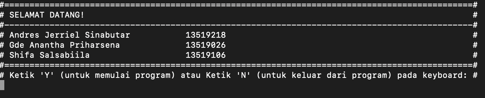
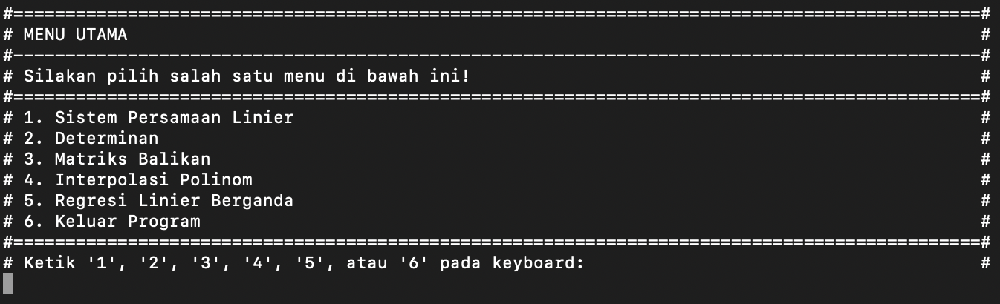
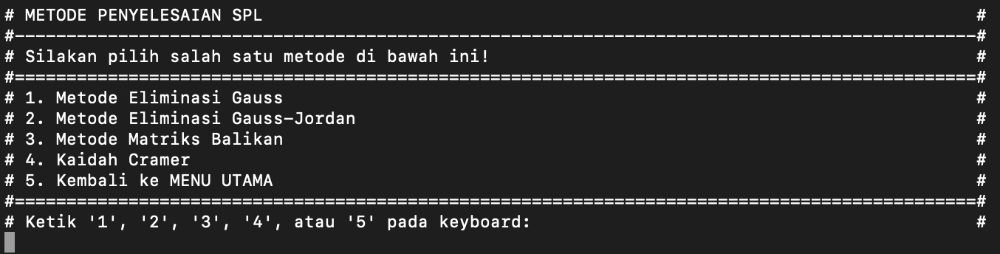
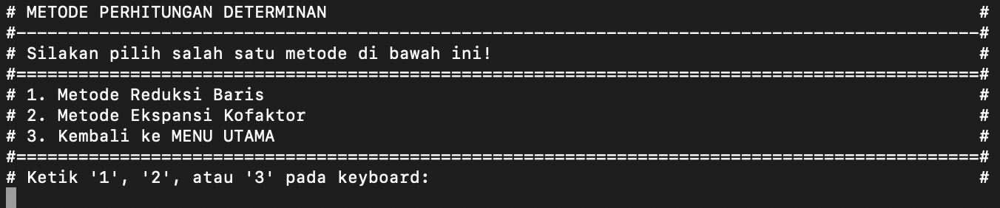
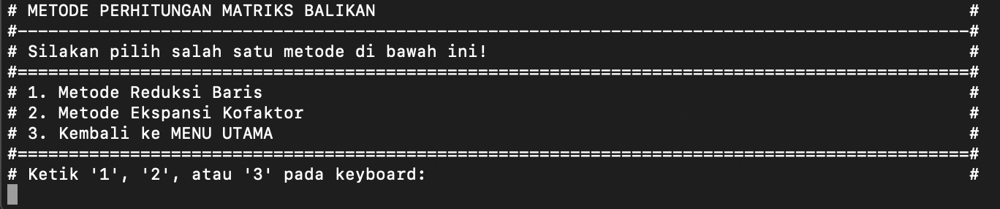

# Tubes1Algeo
Tugas Besar 1 Aljabar Linear dan Geometri (IF2123)
Anggota Kelompok:
1. Andres Jerriel Sinabutar     13519218
2. Gde Anantha Priharsena    13519026
3. Shifa Salsabiila                   13519106

## WELCOME!

Untuk menjalankan program melalui command line, silakan navigasi ke folder bin. Kemudian masukkan:
```
  java TubesAlgeo
```

Masukkan 'Y' dan ikuti petunjuk yang ditampilkan di dalam program serta yang ada pada file README.md ini.

## MENU UTAMA

Masukkan angka yang sesuai dengan operasi yang ingin dilakukan

### 1. SISTEM PERSAMAAN LINIER

Silakan mengikuti format input seperti yang dituliskan pada layar setelah memilih metode masukan.
> Untuk solusi SPL dengan metode **Matriks Balikan** dan metode **Cramer** hanya bisa digunakan untuk matriks bujur sangkar (matriks dengan ukuran n x n). Selain itu, dapat menggunakan metode **Eliminasi Gauss** dan metode **Eliminasi Gauss-Jordan**.

### 2. DETERMINAN

Silakan mengikuti format input seperti yang dituliskan pada layar setelah memilih metode masukan.
> Operasi determinan hanya menerima masukan matriks bujur sangkar (matriks dengan ukuran n x n).

### 3. MATRIKS BALIKAN

Silakan mengikuti format input seperti yang dituliskan pada layar setelah memilih metode masukan.
> Operasi matriks balikan hanya menerima masukan matriks bujur sangkar (matriks dengan ukuran n x n).

### 4. INTERPOLASI POLINOM
Silakan mengikuti format input seperti yang dituliskan pada layar setelah memilih metode masukan.

### 5. REGRESI LINIER BERGANDA
Silakan mengikuti format input seperti yang dituliskan pada layar setelah memilih metode masukan.

## PENULISAN HASIL
Hasil dari operasi yang dipilih dapat disimpan dalam sebuah file ataupun hanya ditampilkan pada layar. Jika pengguna memilih untuk menyimpan hasil dalam sebuah file, maka setelah diminta, masukkan nama file tujuan (tidak harus sudah ada sebelumnya). Hasil yang disimpan dalam sebuah file akan tetap ditampilkan terlebih dahulu pada layar.
